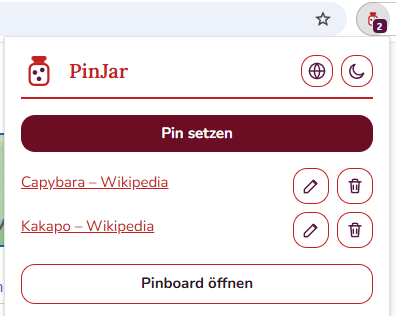
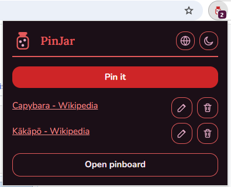
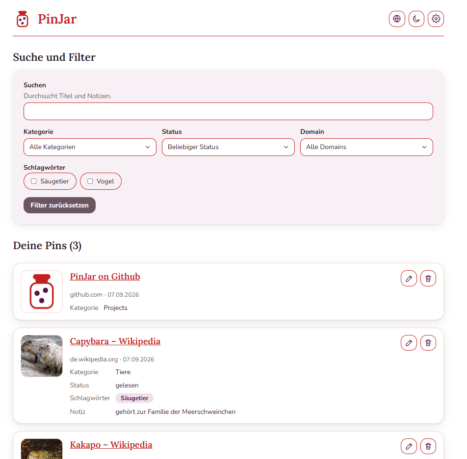
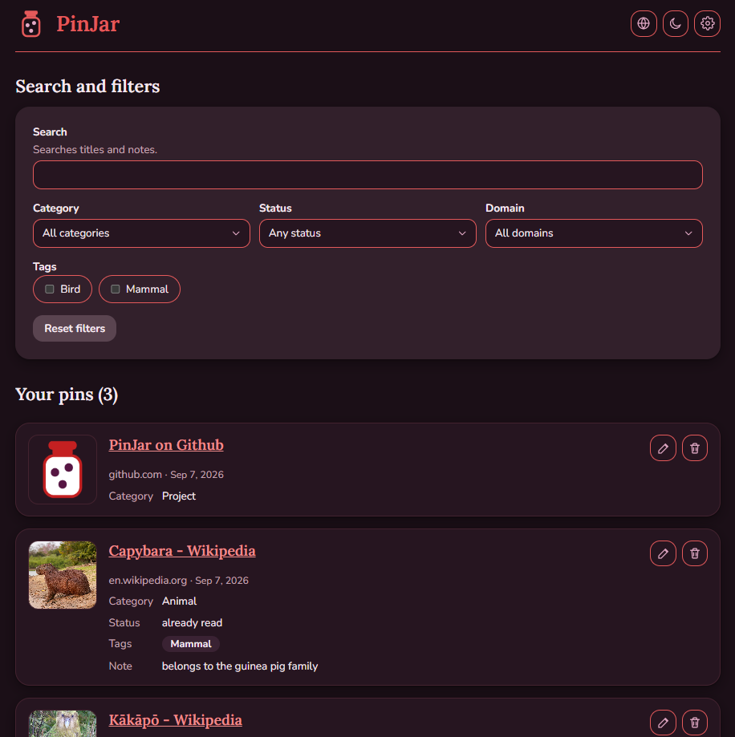

# PinJar

[](https://github.com/AngelikaKebhart/pinjar/actions/workflows/ci.yml)
[](LICENSE)

A cross-browser extension (Chrome, Firefox, Edge) that acts as a universal, shop-independent
wishlist. Save any page with one click, then find it again — no account, no sign-up, no backend.

Everything stays **local to your browser** (`storage.local`). Come back to a site you already
saved something on and the toolbar icon shows how many links you have there.

<table>
  <tr>
    <td width="50%"></td>
    <td width="50%"></td>
  </tr>
  <tr>
    <td></td>
    <td></td>
  </tr>
</table>

## Features

- **One-click saving** from the toolbar, with title and preview image read from the page.
- **A badge per domain**, counting what you already saved on the site you are on.
- **Organize** links with a category, tags, an optional status in your own wording, and a note.
- **Popup** for the current site, **Dashboard** for everything — with search and filters by
  category, tags, status and domain. Both edit links in place.
- **Rename or delete** any category, tag or status across every link carrying it, without the
  links going with it.
- **Export and import** as JSON, plus deleting all your data at once.
- **German and English**, switchable at any time; light, dark, or whatever the browser is set to.

## Try it out

No store publication needed. Requires [Node.js](https://nodejs.org/) 20+ and
[pnpm](https://pnpm.io/) — this project uses pnpm exclusively, not npm and not yarn.

```bash
corepack enable   # once, if pnpm is not installed yet
pnpm install
pnpm build        # or: pnpm build:firefox / pnpm build:edge
```

**Chrome / Edge** — open `chrome://extensions` (or `edge://extensions`), enable **Developer
mode**, click **Load unpacked** and pick `.output/chrome-mv3`.

**Firefox** — open `about:debugging#/runtime/this-firefox`, click **Load Temporary Add-on** and
pick `.output/firefox-mv2/manifest.json`. Temporary add-ons are gone after a restart. Firefox 128
or newer is required, because Tailwind 4 emits CSS that older versions render wrong.

## Development

```bash
pnpm dev           # launches a browser with the extension loaded, hot-reloads on save
pnpm check         # lint, typecheck, tests and formatting — the four gates CI runs
```

`pnpm dev:firefox` and `pnpm dev:edge` target the other two browsers. The individual checks are
`pnpm lint`, `pnpm typecheck`, `pnpm test`, `pnpm format:check` and `pnpm audit`; all of them run
in [CI](.github/workflows/ci.yml) on every push and pull request, alongside a build for all three
browsers. Accepted audit advisories are listed with a reason and a removal condition in
[`pnpm-workspace.yaml`](pnpm-workspace.yaml).

**Debugging:** right-click inside the popup and choose _Inspect_; the dashboard is a normal tab
with normal DevTools; the background worker has a _Service Worker_ link on the extension's card in
`chrome://extensions`. Page metadata is read by a script injected into the active tab, so its
output appears in that page's console, not the extension's.

### Layout

```
entrypoints/     popup/, dashboard/, background.ts (badge logic)
src/lib/         storage, data model, filtering, URL parsing — no React in here
src/components/  shared UI
src/i18n/        the de/en message catalogs and the translation hook
```

The full product concept, the data model and the reasoning behind them are in
[`docs/concept.md`](docs/concept.md) (written in German).
[`docs/firefox-manual-test.md`](docs/firefox-manual-test.md) lists what has to be clicked through
by hand there, since Firefox is the only MV2 target and the test suite cannot cover the difference.

### Translations

Two mechanisms, because they answer different questions:

| What                                   | Where                    | Language decided by                    |
| -------------------------------------- | ------------------------ | -------------------------------------- |
| Extension name and description (store) | `public/_locales/<lang>` | the browser, natively — not switchable |
| Everything inside Popup and Dashboard  | `src/i18n/<lang>.json`   | the user's choice, stored locally      |

`browser.i18n` cannot be switched at runtime, which is why the UI relies on own catalogs instead
(see [`docs/concept.md`](docs/concept.md) §6.3).

- Never write a literal string into a component — add a key and resolve it through
  `useTranslation()`. That includes `alt`, `aria-label`, `title` and placeholders.
- Add every key to **both** catalogs in the same change; a test fails if the two drift apart.
- Plurals are two keys sharing a base, suffixed `_one` and `_other`, resolved through
  `Intl.PluralRules`: `plural('dashboard.savedLinks.count', n)`.
- Dates and numbers go through `formatDate()` / `formatNumber()`, never hand-built strings.
- Never translate what the user typed, or what came from a website.
- Check new UI in both languages: German runs 20–35% longer and finds every fixed width.

## Privacy

All data is stored locally and never transmitted to a server. Only what the features need is
kept: page URL, title, preview image, your own input, and your interface preferences. No account,
no tracking, no analytics, no cookies. Translations ship in the bundle — no translation service is
contacted.

**One exception worth knowing about:** preview images are stored as URLs rather than as image
data, so the dashboard loads them from the sites they came from, which is the only point at which
this extension talks to the network at all. Nothing PinJar stores is ever sent.

Full details, including what is kept, for how long, and your rights under the GDPR:
**[Privacy Policy](docs/privacy-policy.md)**

**[Datenschutzerklärung](docs/privacy-policy.de.md)**

### Permissions

| Permission  | What it is for                                                                   |
| ----------- | -------------------------------------------------------------------------------- |
| `storage`   | keeping your saved links on this device                                          |
| `activeTab` | reading title and preview image of a page — only when you click save on it       |
| `scripting` | running that one read-only extraction in the page you are saving                 |
| `tabs`      | reading the address of open tabs, to count what you saved on the site you are on |

There is **no host permission**, so the extension never gains access to the content of the pages
you visit. `tabs` is the one with a visible cost: browsers present it at install as _"read your
browsing history"_, because it lets the extension see the addresses of your open tabs. It is what
makes the badge possible — those addresses are compared in memory against your locally saved
domains to produce a number, and are never stored, logged, or sent anywhere.

## How this was built

PinJar was written with [Claude Code](https://claude.com/claude-code) as the implementing agent,
directed and reviewed by me. The interesting part of this repository is therefore not only the
extension but [`.claude/`](.claude/): the project's conventions are written down as agent skills
rather than left to habit — English-only code with a fully externalized bilingual UI, WCAG 2.2 AA
as a hard requirement, GDPR-minimal data handling, the Git workflow, and the rules for when work
may be delegated to a subagent. [`CLAUDE.md`](CLAUDE.md) is the standing brief that ties them
together.

Commits carry a `Co-Authored-By` trailer where an agent wrote them. Every change went through the
same review, CI and manual-testing gates it would have without one.

## Feedback

Bug reports, ideas and remarks are genuinely welcome —
[open an issue](https://github.com/AngelikaKebhart/pinjar/issues). Something that looks like a
security problem goes through [`SECURITY.md`](SECURITY.md) instead, not into a public issue.

Code contributions are not being sought, though. This is a personal project and stays one, so an
unannounced pull request will most likely be declined — please raise an issue first rather than
spending your time on a patch.

The conventions the code is held to, for anyone reading it:

- `main` is stable; work happens on feature branches merged via pull request. A `pre-push` hook in
  [`.githooks/`](.githooks/) rejects direct pushes to `main` and is activated by `pnpm install`.
- Commits follow [Conventional Commits](https://www.conventionalcommits.org/), in English.
- All code, comments and documentation are English — user-facing text is the exception and lives
  in the translation catalogs.
- The UI must meet WCAG 2.2 Level AA.

## License

[MIT](LICENSE). The bundled Lora and Nunito webfonts are under the SIL Open Font License 1.1;
their license texts ship in [`public/fonts/`](public/fonts/).
